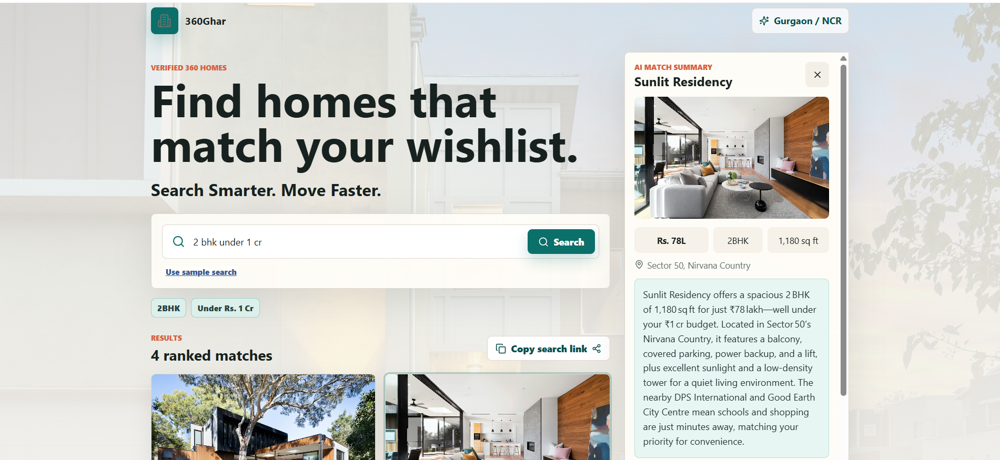

# 360Ghar AI Property Search Assistant

A polished React + TypeScript prototype for the 360Ghar Software Developer Intern assignment. Users describe their Gurgaon property needs in natural language, OpenRouter parses the request into structured filters, and the app ranks mock property cards with personalized match reasons.

    

## DEMO VIDEO

LINK - https://www.loom.com/share/8258b438f6964da69ec7589dffe2b4d1

## Setup

```bash
npm install
cp .env.example .env
npm run dev
```

Add your OpenRouter key in `.env`:

```bash
VITE_OPENROUTER_API_KEY=your_key_here
VITE_OPENROUTER_MODEL=openai/gpt-oss-20b:free
```

The default model is `openai/gpt-oss-20b:free`. If that free model is rate-limited or its provider fails, the app automatically retries with `openrouter/free`. You can also set `VITE_OPENROUTER_MODEL=openrouter/free` directly.

## Tech Stack

- React
- TypeScript
- Vite
- OpenRouter API
- CSS3

## What It Does

- Natural-language AI search for Gurgaon properties.
- OpenRouter query parsing into `location`, `sector`, `bhk`, `maxPriceLakhs`, `amenities`, `preferences`, and `mustHaves`.
- Local ranking over 10 realistic mock properties.
- Property cards with BHK, area, price, location, thumbnail, amenities, and match badge.
- Live AI summary on card click.
- Bonus feature: shareable search links using `?q=...`.

## Architecture

                User Query
                    ↓
             OpenRouter Parser
                    ↓
             Structured Filters
                    ↓
            Local Ranking Engine
                    ↓
               Property Cards
                    ↓
         OpenRouter Summary Generator


- `src/lib/openRouterClient.ts` handles OpenRouter calls and robust JSON extraction.
- `src/lib/ranking.ts` scores mock properties against parsed filters and generates match reasons.
- `src/lib/urlState.ts` manages shareable search URLs.
- `src/components/*` keeps the UI split into small, readable pieces.
- `src/data/properties.ts` contains mock Gurgaon listings with amenities, nearby places, and positioning signals.

LLM calls are made directly from the frontend because this assignment allows a backend-free prototype.

## Prompt Design Notes

- Query parsing uses a strict system prompt that asks for JSON only, with nulls and arrays for missing values.
- The parser prompt includes the exact target schema so the UI can consume a stable shape.
- I keep ranking local instead of asking the LLM to rank cards, which makes results deterministic and easier to explain.
- The summary prompt receives the original user query plus one property object, then asks for 2-3 concise lines.
- I avoided long chain prompts because free models can drift; short schema-first prompts were more reliable.
- If the LLM response is unavailable or malformed, the app falls back to a lightweight rule-based parser so the prototype remains usable during demos.
- openai/gpt-oss-20b:free was selected because it produced the most consistent structured JSON responses during testing while remaining available on the free OpenRouter tier.
- `openrouter/free` is documented as the fallback model option because free model availability can vary.

## Loom Demo Checklist

1. Run a search: `2BHK in Sector 50 Gurgaon under 80 lakhs, good sunlight, near a school`.
2. Point out parsed filters and ranked cards.
3. Open one property and show the AI-generated personalized summary.
4. Click copy search link, paste into a new tab, and show the same search restored.
5. Briefly mention prompt design and fallback behavior.

## Useful Test Queries

```text
2BHK in Sector 50 Gurgaon under 80 lakhs, good sunlight, near a school
3BHK under 1.5 crore near metro with balcony
Affordable 1BHK in Gurgaon for investment
Family home near DPS with good natural light
```
